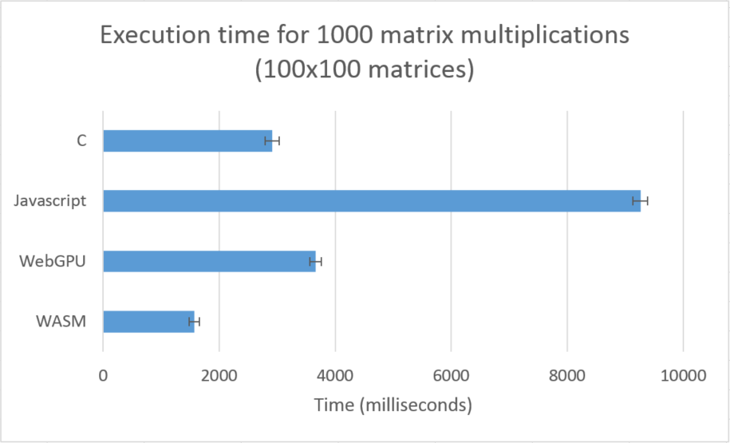
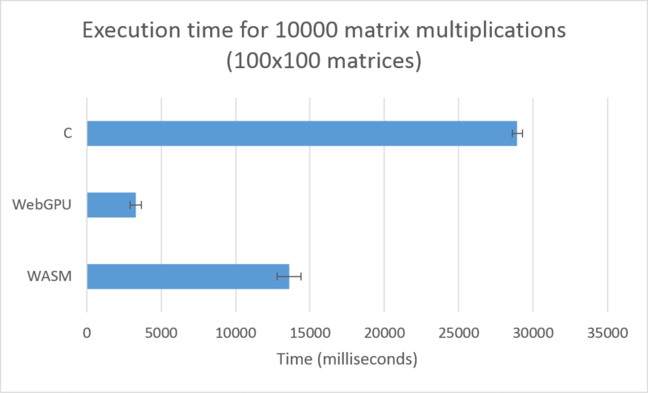

# WebAssembly_Matrices
Matrix multiplication implementations in C, Javascript, WebAssembly Text Format, and WebGPU

- The code is separated into four types, with respectively named HTML and JS files.
- The folders in the root directory contain the code as demos, which show results in the debug console for a small matrix multiplication.
## Javascript
- Code written in plain Javascript.
## WebAssembly (WASM)
- Code written in WebAssembly text format.
## C
- Code written in C and compiled using GCC.
- This code is compiled without optimizations.
## WebGPU
- Code written in Javascript using WebGPU.

# Performance Testing
- Two 100x100 matrices were multiplied by each other 1000 times.
- Each implementation was tested 5 times and the results are shown below.
- Standard deviation bars are included.
- WebGPU and WASM were also evaluated again with 10000 iterations to demonstrate WebGPU's power at larger scales.

## Various Notes
- No extensive debug console outputs are present during performance testing, as repeated console.log calls are relatively expensive (all outputs are stored in memory).
- The matrices were generated randomly and hard-coded into evaluation scripts.
- Javascript tests were run using Google Chrome 84.0.4147.105 (64-bit)
- WebGPU required Google Chrome Canary (86.0.4220.0 was used)
- The WASM code (and none of the others) took almost 2.5 times as much time to run when the developer console was open in Chrome.
- The C code was run on a similar machine that showed very similar WebAssembly results.
- All other code was run on a Microsoft Surface Pro 6.

# Conclusions
- Plain Javascript runs slower than C, WebGPU, or WASM code.
- While C and WASM code outperform WebGPU at 1000 matrix multiplications, scaling up to 10000 matrix multiplications shows that WebGPU is significantly faster.
- This is likely due to the parallization capabilities of the GPU.